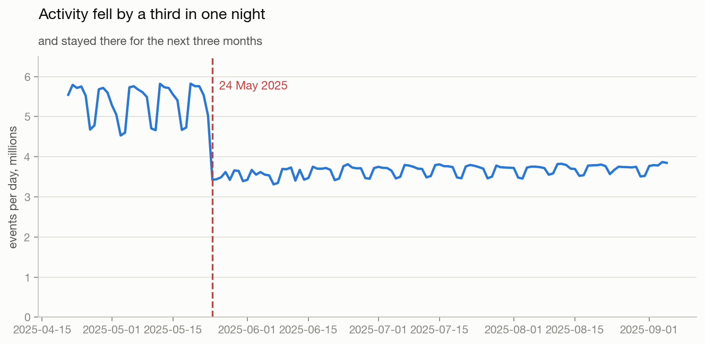
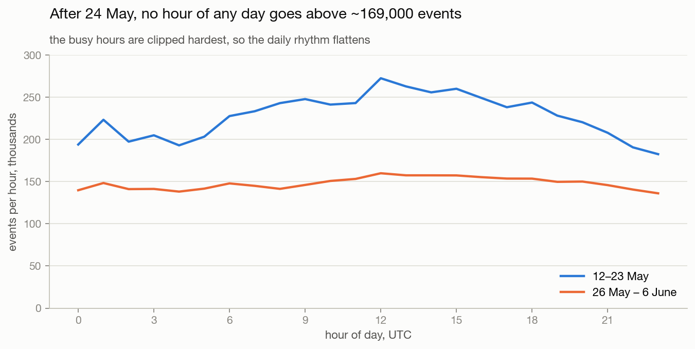
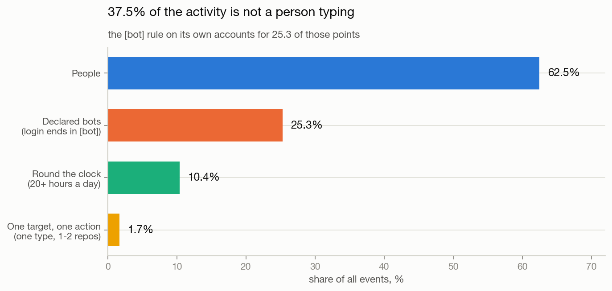
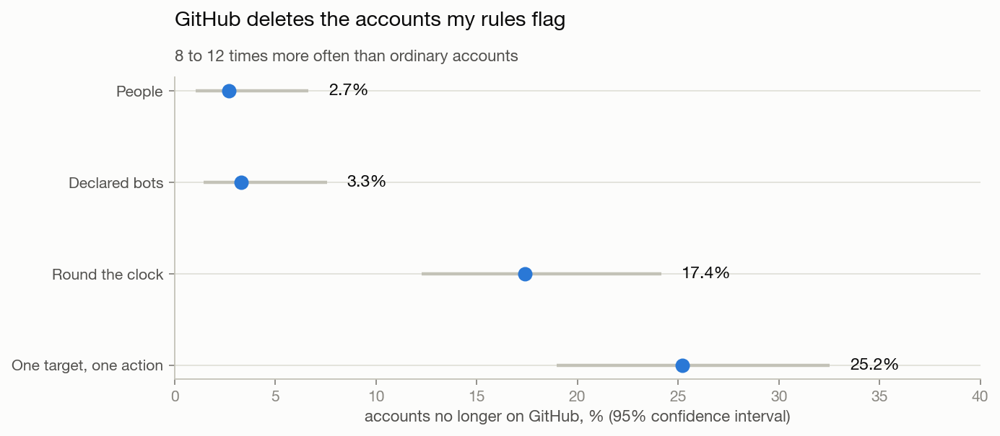

# Before you trust a number

**Question:** GitHub's activity dropped by a third overnight in May 2025. Did
users leave?

**Answer:** no. Nothing happened to users. The pipeline started throttling, and
a third of what was left was never human in the first place.

Window: 21 April – 5 September 2025, 138 consecutive days, 560,839,725 events.
Notebook: [`notebooks/01_data_quality.ipynb`](../notebooks/01_data_quality.ipynb).
Code: [`src/bots.py`](../src/bots.py), [`src/validate.py`](../src/validate.py).
Field definitions and data caveats: [`data_notes.md`](data_notes.md).

---

## The standard checklist passes

Duplicates, missing values, broken types — run first, on 108 million rows from
June 2025:

| Check | Result |
|---|---|
| Duplicate rows | **47** |
| Missing actor, repo or timestamp | **0** |
| Broken types or dates | **0** |

47 bad rows in 107,911,604. If cleaning stopped here the conclusion would be
"the data is clean", and that conclusion would be wrong. The checklist tests
whether the data is *well-formed*. It says nothing about whether it is *true*.

---

## 1. The drop that was not users

Daily events, April to June 2025:



```
23 May (Fri)   5.02M
24 May (Sat)   3.42M   <- and it never comes back
```

Weekdays ran at 5.5–5.8M before and 3.5–3.7M after: a 34.2% fall in one night
that holds for the next three months.

Three checks say this is not behaviour.

**It hit everything equally.** Every event type fell by roughly the same amount:
pushes −34.7%, pull requests −31.1%, stars −35.4%, issues −35.7%, comments
−33.5%. Real changes in how people work do not move stars and code review by the
same number.

**It hit every kind of account equally.** People −33%, declared bots −35%. Users
leaving would not take the bots with them.

**There is a ceiling.** Before 24 May the busiest hour of a day carried
251,000–281,000 events. From 24 May on, no hour of any day goes above about
169,000. That is not a distribution, that is a limit.

### The part that matters for analysis

A cap is not a random sample. It bites hardest where there is most to cut:

| Hour (UTC) | Before | After | Kept |
|---|---|---|---|
| 08:00 | 242,859 | 141,297 | 58.2% |
| 12:00 (busiest) | 272,325 | 159,800 | 58.7% |
| 23:00 (quietest) | 182,402 | 136,026 | 74.6% |



So the daily rhythm flattens: peak-to-trough was 1.49× before the cap and 1.17×
after. Anyone measuring how peaked the traffic is, or how much headroom the busy
hours need, would get a 22% different answer from data where nothing about users
had changed.

**Any comparison that spans 24 May 2025 is invalid**, and the data after it
under-represents busy hours — and with them the busiest users.

---

## 2. A third of the activity is not a person

Three rules, each catching what the one before it misses. An account-day is
assigned to the first rule it matches, so the shares add up to the whole.

| | Share of events |
|---|---|
| People | 62.5% |
| Declared bots — login ends in `[bot]` | 25.3% |
| Round the clock — active 20+ hours of the day, 200+ events | 10.4% |
| One target, one action — 200+ events, one event type, ≤2 repositories | 1.7% |



The volume floor of 200 sits far above where people stop. On 11 June 2025 the
median account produced 2 events, the 99th percentile 29, the 99.9th 166.

**The rule everyone uses finds two thirds of the problem.** Filtering on
`[bot]` removes 25.3% of events. The real figure is 37.5%. The missing 12.2
points are accounts GitHub does not mark, because they are ordinary user
accounts with a script behind them.

What the behavioural rules catch, over the 138 days:

```
freefastconnect   1,797,320 events   1 repository         23 hours a day, 114 days
direwolf-github   1,592,166 events   2,643 repositories   24 hours a day, 137 days
Copilot           1,444,881 events   1,986 repositories   24 hours a day, 138 days
SoliSpirit        1,336,980 events   2 repositories       24 hours a day, 135 days
```

`freefastconnect` pushed to a single repository 1.8 million times across 114
active days. That is roughly eleven pushes a minute, day and night.

---

## 3. Checking the rules against GitHub itself

The API cannot confirm these are bots — it reports `"type": "User"` for every
account the behavioural rules flag, because that is what they are. Asked about
150 accounts per rule, it labelled all 145 surviving declared bots as `Bot` and
all 127 surviving round-the-clock accounts as `User`.

So the check has to come from somewhere else: **does GitHub eventually remove
them?**

| Rule | Accounts gone | Rate | 95% CI |
|---|---|---|---|
| People | 4 / 150 | 2.7% | 1.0–6.7% |
| Declared bots | 5 / 150 | 3.3% | 1.4–7.6% |
| Round the clock | 27 / 155 | 17.4% | 12.3–24.2% |
| One target, one action | 39 / 155 | 25.2% | 19.0–32.5% |



Accounts the behavioural rules flag are 8 to 12 times more likely to have been
deleted or suspended (Fisher exact, odds ratio 7.7, p = 1.4 × 10⁻⁵, and odds
ratio 12.3, p = 3.9 × 10⁻⁹).

This is corroboration, not proof. GitHub removes accounts for reasons that have
nothing to do with automation, and plenty of legitimate automation is never
removed. What it rules out is that the rules are firing at random.

One lead worth recording so nobody chases it twice: the number of public
repositories an account owns is almost useless here. Round-the-clock accounts
hold a median of 8 against 4 for people, which looks like something until you
notice it is one of two comparisons at p = 0.035 — and the other comparison,
one-target accounts at a median of 5, comes back at p = 0.55. Not a rule.

---

## 4. The account you are counting may not be one account

Two smaller traps, both of which quietly corrupt any per-user metric.

**A login is not an identity.** Over these 138 days, 2,289 logins were used by
more than one account, one of them by 19 different accounts. Two separate
accounts both posted as `Copilot`, 1.44M events and 0.60M events. Joining on the
login merges them into one.

**Logins change.** 119,857 accounts changed their login inside the window, one
of them 43 times. Keyed on the login, each of those looks like one user leaving
and another arriving.

`actor_id` never changes, and everything here keys on it.

---

## What I would do about it

**Check the pipeline before explaining the number.** A 34% drop should have
triggered one query — events per hour — before anyone wrote a word about user
behaviour. The ceiling is visible in thirty seconds. Any metric that moves more
than, say, 15% in a day deserves that check automatically, and it is cheap
enough to run as an alert.

**Report the automation share next to the metric, not instead of it.** Removing
bots entirely is the wrong call: on a developer platform the automation *is*
part of the product, and 37.5% of it is worth watching. What is wrong is letting
it sit inside "active users" unlabelled. Split every headline metric into people
and automation, and watch the ratio — it went from 0% in 2015 to 38% in 2025,
which is itself the story.

**Do not trust `[bot]` on its own.** It finds two thirds. Add the two
behavioural rules and re-run them every quarter, because the shape of automation
keeps changing — the biggest undeclared account in this window, `Copilot`, did
not exist two years earlier.

**Key on the immutable id.** Never on the display name.

## How I would measure whether this worked

Pick the ten metrics on the main dashboard. For each, compute the automation
share and the pipeline-completeness check across the last two years of history.
The test is not whether the numbers change — they will. It is how many of the
past decisions made on those dashboards would have gone differently. That is the
number to put in front of the team.

---

## Caveats

- Public activity only. Private repositories are invisible, so this measures the
  public timeline, not GitHub.
- The rules are thresholds, and thresholds are judgement. Moving the volume
  floor from 200 to 500 would shift the 12.2-point gap; the floor is where it is
  because people stop well below it, and the sensitivity is worth checking
  before the numbers are used for anything.
- The deletion check is correlation. It says the rules are not random. It does
  not say every flagged account is a bot.
- The 2026 data is worse than anything described here — the feed degrades
  through 2026 until pushes are 96% of all events and some days carry almost
  nothing. That is why this analysis stops in September 2025. Details in
  [`data_notes.md`](data_notes.md).
